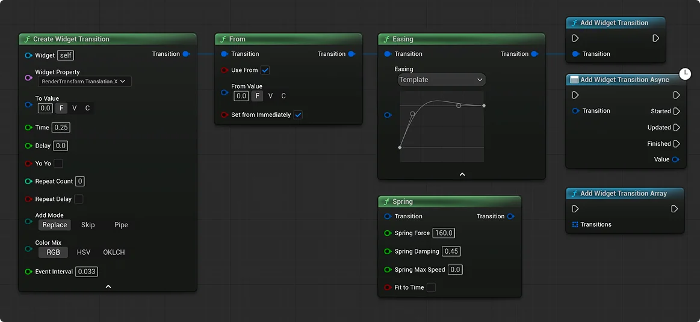
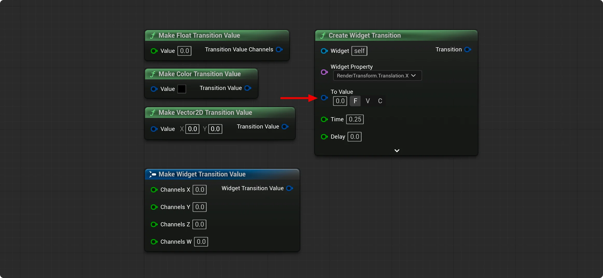

# UMGTransitions

Runtime UMG property transitions for Unreal Engine 5: widgets, transforms, material parameters, colors, text counters, springs, easing, callbacks, and Widget Selector.

## Principles

UMGTransitions is a procedural animation tool for transitions between two widget states, built on [Material Motion](https://m3.material.io/styles/motion/overview) and [Fluent Motion](https://fluent2.microsoft.design/motion) principles adapted to UMG:

1. Animations are short and do not block user interaction.


2. Animation responds immediately to user input: a new transition replaces the previous one and continues from the current state toward the new target.


3. Animations help explain what appeared, disappeared, changed, or moved in the interface. Animation for its own sake is unnecessary.


4. The primary element animates first, followed by related details.


5. The curve defines the character of the motion.


## How it works

A transition is built with Blueprint nodes and added to the system through `Add Widget Transition`. Each transition is scoped to a specific widget. A transition cannot be added without a valid widget.



1. `Widget Property` binds the transition to a property of the connected widget. Available properties depend on the widget's type, while the base properties `RenderTransform` and `RenderOpacity` are always available. Scalar and vector material parameters are also supported.


2. `From` sets an explicit starting value, such as zero opacity or an off-screen position for an entrance animation. If omitted, the system reads the property's current value when the transition starts.


3. `Easing` controls acceleration and deceleration using a cubic Bézier curve defined by just two control points. Choose a preset or adjust the points manually while preserving the specified transition duration. `Easing` and `Spring` are mutually exclusive: a transition uses one or the other.


4. `Spring` simulates spring motion with inertia and damping. When the target changes, it preserves the current value and velocity so motion continues smoothly and naturally.


5. `Add Mode` determines how a transition is added. `Replace` replaces the current transition, `Skip` yields to the active one and does not start, and `Pipe` queues the transition after the current one. For complex animations, use UMG Animation Editor. Transitions are grouped by property.


6. `ColorMix` selects the color space used to calculate intermediate shades when blending colors: `RGB`, `HSV`, or `OKLCH`.


7. `Event Interval` controls how often the async node fires `Updated` events and properties emit `FieldNotify` notifications.


8. `Transition Value` stores values in a universal four-channel buffer. This lets you control multichannel properties, such as vectors and colors, with a single number. At runtime, the buffer is processed as a vector, allowing vector channels to change naturally.



## C++

The plugin was designed primarily for Blueprint, where UMG interfaces are usually built and widget properties are easier to select and control visually. Transitions can also be created and started from C++ using the builder.

```cpp
#include "WidgetTransitionBuilder.h"

FWidgetTransitionBuilder::Make(this)
    .Target(this, FName(TEXT("RenderOpacity")))
    .To(0.0f)
    .Time(0.25f)
    .Add();
```

## Composer

Composer turns a UMG hierarchy into a deterministic animation sequence. Collect the widgets, calculate their wave, then use `WaveIndex × Delay` to stagger transitions. It crosses nested `WidgetTree → UserWidget` boundaries and returns each item with its widget, depth, wave index, and wave direction.

| Function | Purpose |
| --- | --- |
| `Collect Widgets` | Selects a hierarchy by depth-first or breadth-first traversal and sibling order. |
| `Apply Widget Wave` | Assigns waves using Horizontal, Vertical, Manhattan, or Radial patterns and a corner, center, or widget origin. |
| `Sort Widgets by Wave` | Stably orders the composition near-to-far or far-to-near. |
| `Get Widget Children` / `Get Widget Descendants` | Provides direct or legacy one-call hierarchy selection. |
| `Find Widget by Name` / `Find Widget Descendants by Name(s)` | Targets named widgets in a UserWidget or subtree. |

## Version support

| Feature | UE 5.x | UE 4.27 |
| --- | --- | --- |
| Widget property bindings | Supported | Supported |
| Material parameter bindings | Supported | Supported |
| `FieldNotify` notifications | Supported | Not supported |
| Source | `main`, `v2.x` tags | `ue4.27` branch, `v1.x` tags |

## Performance

Transition storage and runtime scheduling are lightweight for UI animation: 500 eased transitions take 0.053070 ms/frame, about 0.3% of a 16.67 ms frame at 60 FPS. The main incremental cost is cubic Bézier evaluation per transition.

| Case | 10 transitions | 100 transitions | 500 transitions | Complexity |
| --- | ---: | ---: | ---: | --- |
| Linear `RenderOpacity` tick (ms/frame) | 0.000395 | 0.003852 | 0.021689 | O(n) |
| Easing `RenderOpacity` tick (ms/frame) | 0.001015 | 0.010000 | 0.053070 | O(n) |
| Spring `RenderTransform.Translation` tick (ms/frame) | 0.000512 | 0.004914 | 0.035552 | O(n) |
| Custom property tick, reflective binding (ms/frame) | 0.000313 | 0.003413 | 0.021078 | O(n) |
| Spring target update (ms/frame) | 0.000521 | 0.004996 | 0.036666 | O(n) |
| Transition removal, `ClearTransitions` (ms/removal) | 0.000169 | 0.001316 | 0.007057 | O(n) |
| Transition update, `Replace` mode (ms/start) | 0.000749 | 0.003482 | 0.057850 | O(n) |
| Async node, `Updated` every frame (ms/frame) | 0.002959 | 0.032371 | 0.150503 | O(n) |
| Async node, `Updated` with update-frame skipping, 33 ms interval (ms/frame) | 0.001638 | 0.015754 | 0.074650 | O(n) |

## Testing

Run all editor automation tests with `Automation RunTests UMGTransitions.WidgetTransition`.

| Test group | Coverage | Purpose |
| --- | --- | --- |
| Runtime | Values, binding channels, easing fallback, spring convergence, delay/repeat/YoYo, and add modes | Keeps public transition behavior stable. |
| Callbacks | Started/Updated/Finished values, intervals, cancellation, reentrancy, and `RemoveAtSwap` | Ensures callbacks can safely change transitions. |
| Widget Selector | Tree traversal, ordering, duplicate filtering, and wave translation | Keeps selector output deterministic. |
| Editor | Blueprint node metadata and easing-curve editor integration | Protects Blueprint authoring UX. |
| Diagnostics | Runtime structure layout and storage budgets | Makes memory-layout changes visible. |
| Performance | Tick, easing, springs, custom properties, callbacks, async updates, `ClearTransitions`, and `Replace` | Tracks scaling and regressions at 10/100/500 transitions. |
